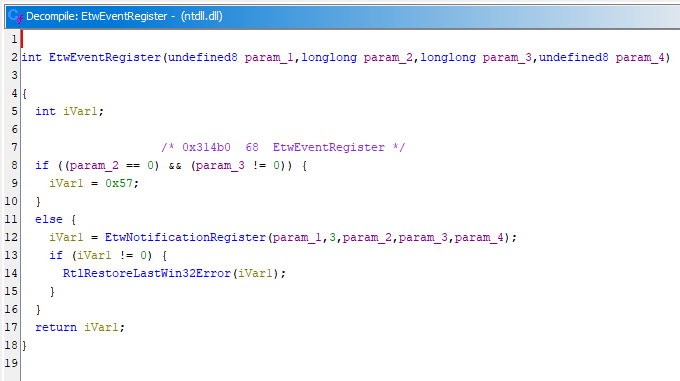
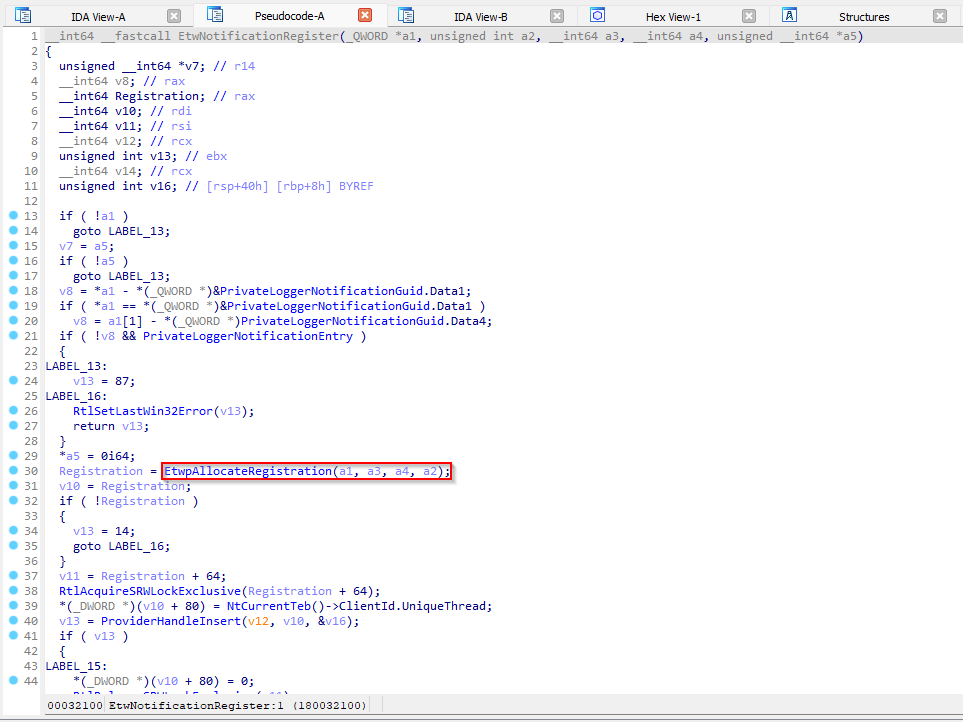
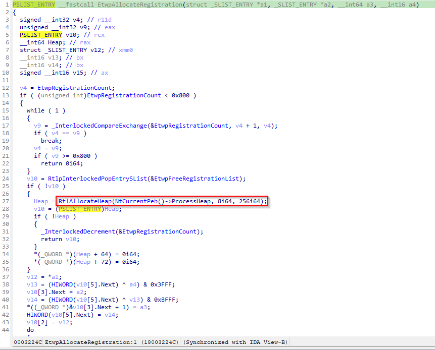
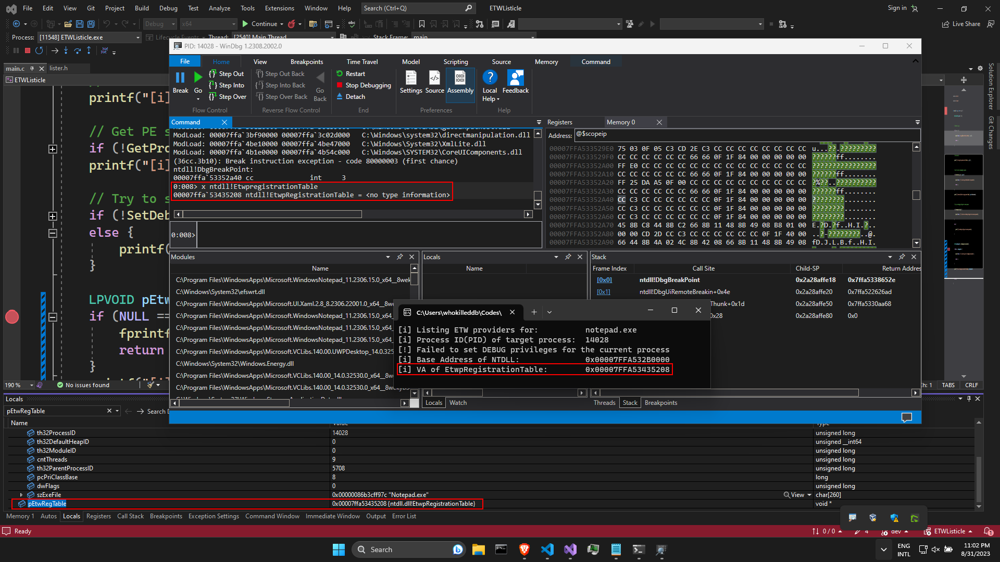

# ETWListicle
List the ETW provider(s) in the registration table of a process

## Usage

```
ETWListicle.exe notepad.exe
```

## Code Breakdown
> Note that this section may exclude error checks just to keep things simple

### The Main Function
As usual, we start with the `main()` function:

```c
int main(int argc, char** argv) {
	// Check CLI args
	if (argc != 2) {
		fprintf(stderr, "Usage:\n\t%s <PROCESS NAME>\n", argv[0]);
		return -1;
	}

	// Print details
	printf("[i] Listing ETW providers for:\t\t%s\n", argv[1]);

	// Get Process ID for the target process
	DWORD pid = FindPid(argv[1]);
	printf("[i] Process ID(PID) of target process:\t%d\n", pid);

	SetDebugPrivilege();
	
	ParseRegistrationTable(pid);
	return 0;
}
```

The main function begins by checking the command line arguments, and if supplied correctly, fetches the target process's name from the CLI and passes it to the `FindPid()` function to fetch the Process ID of the target process:

```c
// Defined in utils.h
DWORD FindPid(char* procname) {
	PROCESSENTRY32 _temp = { 0 };
	_temp.dwSize = sizeof(PROCESSENTRY32);
	HANDLE hProcSnap = CreateToolhelp32Snapshot(
		TH32CS_SNAPPROCESS, //  Take a snapshot of the processes
		0                   //  Capture a snapshot of all processes in the system
	);
	Process32First(hProcSnap, &_temp);
	// Loop through Snapshot entries
	while (Process32Next(hProcSnap, &_temp)) {
		if (lstrcmpiA(procname, _temp.szExeFile) == 0) {
			CloseHandle(hProcSnap);
			return _temp.th32ProcessID;
		}
	}
	CloseHandle(hProcSnap);
	fprintf(stderr, "[!] No %s process found\n", procname);
	return 0;
}

```

We use `CreateToolhelp32Snapshot()` to create a snapshot of all the system processes and then use a combination of `Process32First()` and `Process32Next()` to iterate through the process entries in the system snapshot. We check the `szExeFile` field of the entries to see if we have a match on the target process's name, and, if found, we return the PID of the target process. 

Once we have the PID of the target process, we try to set `DEBUG` privileges for the current process. This would enable us to open handles to processes we usually don't have access to and read the process memory. To do this, we call the `SetDebugPrivilege()` function.

```c
// Defined in utils.h
BOOL SetDebugPrivilege(void) {
    LUID luid;
    HANDLE  hToken;
    TOKEN_PRIVILEGES tp;
    OpenProcessToken(GetCurrentProcess(), TOKEN_ADJUST_PRIVILEGES, &hToken);
    LookupPrivilegeValueA(NULL, "SeDebugPrivilege", &luid)

    tp.PrivilegeCount = 1;
    tp.Privileges[0].Luid = luid;
    tp.Privileges[0].Attributes = SE_PRIVILEGE_ENABLED;

    AdjustTokenPrivileges(
        hToken,                             // Handle to the token
        FALSE,                              // Modifies privileges as requested
        &tp,                                // Specifies the new privileges 
        sizeof(TOKEN_PRIVILEGES),           // Size of struct
        (PTOKEN_PRIVILEGES)NULL,            // We dont need a handle to old privilege token
        (PDWORD)NULL);                       // Ignore return length

    CloseHandle(hToken);
    return (GetLastError() != ERROR_NOT_ALL_ASSIGNED);
}
```

I ripped this off [Enabling and Disabling Privileges in C++](https://learn.microsoft.com/en-us/windows/win32/secauthz/enabling-and-disabling-privileges-in-c--) - check it out for the indepth explanation, but TLDR: we modify the current process token and try to elevate the current process to have `DEBUG` privileges so that we can easily read process memory of the specified target. 

Finally, we call `ParseRegistrationTable()` to find the `EtwpRegistrationTable` and the corresponding registration entries. But before we look into that, it is important to understand why this is important and how to locate it.

### EtwpRegistrationTable and Registration Entries - Debug Time!

Now this is the part where we pull up our Decompilers. For this exercise, I have used a combination of **IDA-Pro** and **Ghidra**.

We start by loading `ntdll` from `System32` into both of these tools. First, we examine `ntdll!EtwEventRegister` in Ghidra:



Why this particular function? Well, ETW providers are registered by the [EventRegister()](https://learn.microsoft.com/en-us/windows/win32/api/evntprov/nf-evntprov-eventregister) function described in the `Advapi32.dll`, which ultimately passes it on to the `ntdll!EtwEventRegister`, so we are cutting out the middlemen and starting our examination here. 

As we can see, `ntdll!EtwEventRegister` in turn calls `ntdll!EtwNotificationRegister`, looking at the pseudocode for which in **IDA-Pro**, we get the following:



Okay, but why did we skip past the other functions shown in the pseudocode? It is because we are exclusively trying to locate functions and structures associated with registering and allocating provider entries. 

Coming back to `ntdll!EtwNotificationRegister`, we see that it makes a call to `ntdll!EtwpAllocateRegistration`. This function is responsible for allocating registrations in memory:



We see that it calls `RtlAllocateHeap()` with the size parameter set to `0x100` aka, 256 bytes to reserve memory for the registration entries. Meanwhile, if we take a look at the `ETW_USER_REG_ENTRY` struct, we see that it is exactly 256 bytes - just as an extra set of confirmation: 

```c
typedef struct _ETW_USER_REG_ENTRY {
    RTL_BALANCED_NODE   RegList;           // List of registration entries
    ULONG64             Padding1;
    GUID                ProviderId;        // GUID to identify Provider
    PETWENABLECALLBACK  Callback;          // Callback function executed in response to NtControlTrace
    PVOID               CallbackContext;   // Optional context
    SRWLOCK             RegLock;           // 
    SRWLOCK             NodeLock;          // 
    HANDLE              Thread;            // Handle of thread for callback
    HANDLE              ReplyHandle;       // Used to communicate with the kernel via NtTraceEvent
    USHORT              RegIndex;          // Index in EtwpRegistrationTable
    USHORT              RegType;           // 14th bit indicates a private
    ULONG64             Unknown[19];
} ETW_USER_REG_ENTRY, * PETW_USER_REG_ENTRY;
```

Further examining `ntdll!EtwNotificationRegister`, we see that it calls `ntdll!EtwpInsertRegistration` with the value returned from `ntdll!EtwpAllocateRegistration` (which, in all suspect, is the allocated heap address for user registration entry)

Loading up `ntdll!EtwpInsertRegistration` in **IDA-Pro**, we see a reference to `EtwpRegistrationTable`. According to [windows deep internals](https://redplait.blogspot.com/2012/03/etweventregister-on-w8-consumer-preview.html):

> "Now all registered items storing in red-black tree whose root placed in EtwpRegistrationTable"

So now that we know that we have the `EtwpRegistrationTable` structure present in the `.data` segment of `ntdll`, we can use good ol' brute force to locate its virtual address, and we do that with `GetEtwpRegistrationTableVA()` function.

### Forcing our way through - GetEtwpRegistrationTableVA()

The `GetEtwpRegistrationTableVA()` looks as such:

```c
// Located in lister.h
LPVOID GetEtwpRegistrationTableVA(void) {
    DWORD bcount = 0;
    PULONG_PTR data_segment = NULL;

    HMODULE hNtdll = GetModuleHandleA("ntdll.dll");
    PIMAGE_DOS_HEADER pDosHdr = (PIMAGE_DOS_HEADER)hNtdll;
    PIMAGE_NT_HEADERS pNtHdr = (PIMAGE_NT_HEADERS)((ULONG_PTR)hNtdll + pDosHdr->e_lfanew);

    PIMAGE_SECTION_HEADER pSecHdr = (PIMAGE_SECTION_HEADER)((LPBYTE)&pNtHdr->OptionalHeader + pNtHdr->FileHeader.SizeOfOptionalHeader);

    for (DWORD i = 0; i < pNtHdr->FileHeader.NumberOfSections; i++) {
        if (*(PDWORD)pSecHdr[i].Name == *(PDWORD)".data") {
            data_segment = (PULONG_PTR)((ULONG_PTR)hNtdll + pSecHdr[i].VirtualAddress);
            bcount = pSecHdr[i].Misc.VirtualSize / sizeof(ULONG_PTR);
            break;
        }
    }

    for (DWORD i = 0; i < bcount - 1; i++) {
        PRTL_RB_TREE rb_tree = (PRTL_RB_TREE)&data_segment[i];

        if (get_mem_type(rb_tree->Root) == heap) {
            PETW_USER_REG_ENTRY reg_entry = (PETW_USER_REG_ENTRY)rb_tree->Root;
            if (get_mem_type(reg_entry->Callback) == code) {
                return &data_segment[i];
            }
        }
    }

    return NULL;
}
```

---

Going on a tangent here, I want to discuss the `get_mem_type()` function. It's a very hacky function based on a [stackoverflow answer](https://stackoverflow.com/a/59635651). Essentially, I wanted a way to figure out the kind of memory region a pointer is pointing to: primarily to check if it's on the heap or in the code section. Time to break the function down as such:

```c
enum MemType {
	code,
	data,
	heap,
	mapped,
	unknown,
	invalid
};

// See: https://stackoverflow.com/a/59635651
enum MemType get_mem_type(LPVOID ptr) {
	MEMORY_BASIC_INFORMATION mbi = { 0 };

	if (ptr == NULL)  return invalid;

	SIZE_T ret = VirtualQuery(ptr, &mbi, sizeof(MEMORY_BASIC_INFORMATION));
	if (ret == 0) return invalid;
	
	if (ret != sizeof(MEMORY_BASIC_INFORMATION)) return invalid;
	if (mbi.State != MEM_COMMIT) return invalid;
	if (mbi.Protect == PAGE_NOACCESS) return invalid;
	if (mbi.Protect == PAGE_READWRITE) {
		if (mbi.Type == MEM_PRIVATE) return heap;
		if (mbi.Type == MEM_IMAGE) return data;
	}
	if (mbi.Type == MEM_IMAGE && mbi.Protect == PAGE_EXECUTE_READ) return code;
	if (mbi.Type == MEM_MAPPED) return mapped;

	return unknown;
}
```

The function uses `VirtualQuery()` to get information about the memory pages. Now, if a page has:

- RW permissions and the memory page is private, it usually indicates pointers on the heap (especially note that the heap cannot have execute permissions)
- If the memory page within the region is mapped into the view of an image section and is RX, we can say that it belongs to the code section (remember that you cannot write to a code section)

---

Back to `GetEtwpRegistrationTableVA()`. I came across [this stackoverflow question](https://stackoverflow.com/a/6127080) which demonstrates how we can use `GetModuleHandle()` to find the base address of `ntdll` in memory (remember kids, `HMODULE` essentially represents the base address of the module in memory). Once we have the base address, we can walk the PE file till we locate the `.data` section.

Once we have the `.data` section, we use brute force to search for `EtwpRegistrationTable`:

```c
PRTL_RB_TREE rb_tree = (PRTL_RB_TREE)&data_segment[i];
if (get_mem_type(rb_tree->Root) == heap) {
    PETW_USER_REG_ENTRY reg_entry = (PETW_USER_REG_ENTRY)rb_tree->Root;
    if (get_mem_type(reg_entry->Callback) == code) {
        return &data_segment[i];
    }
}
```

We iterate through the data segment and cast each memory pointer into a `PRTL_RB_TREE`, thereby assuming that we have a Red-Black tree struct in that region. Why do we do this? Remember when [windows deep internals](https://redplait.blogspot.com/2012/03/etweventregister-on-w8-consumer-preview.html) said:

> "Now all registered items storing in red-black tree whose root placed in EtwpRegistrationTable"

And since `ntdll!EtwpAllocateRegistration` allocates registration entries on the heap using `RtlAllocateHeap()`, we check if the `Root` entry points to an address on the heap. That's check uno. Assuming we pass check one, we cast the memory pointed by the `Root` entry of the Red-Black tree into a `PETW_USER_REG_ENTRY`, essentially casting the memory region into an `ETW_USER_REG_ENTRY` and verifying if the `Callback` parameter points to a region in the code segment because it essentially points to a callback function(that is pretty self-explanatory).

So, if both the checks pass, we can say that we have successfully located the `EtwpRegistrationTable`. Just to verify that we got this correct, we can put a breakpoint in our code and, at the same time, verify the same with `WinDBG`:



### ParseRegistrationTable()

The function responsible for parsing the `EtwpRegistrationTable` is `ParseRegistrationTable()`.

```c
// Defined in lister.h
// Parse the EtwpRegistrationTable and print registration entries
// Parse the EtwpRegistrationTable and print registration entries
BOOL ParseRegistrationTable(DWORD pid) {
    SIZE_T _retlen = 0;
    RTL_RB_TREE rb_tree = { 0 };
    CHAR sym_search_path[MAX_PATH] = { 0 };

    LPVOID pEtwRegTable = GetEtwpRegistrationTableVA();
    printf("[i] VA of EtwpRegistrationTable:\t0x%p\n", pEtwRegTable);

    // Open Handle to target process
    HANDLE hProcess = OpenProcess(PROCESS_ALL_ACCESS, FALSE, pid);

    // Read EtwpRegistrationTable into memory
    ReadProcessMemory(hProcess, (PBYTE)pEtwRegTable, (PBYTE)&rb_tree, sizeof(RTL_RB_TREE), &_retlen);

    // Load symbols when a reference is made requiring the symbols be loaded.
    (void)SymSetOptions(SYMOPT_DEFERRED_LOADS);

    // Initializes the symbol handler for a process.
    SymInitialize(hProcess, NULL, TRUE);

    // Retrieve the symbol search path
    if (SymGetSearchPath(hProcess, sym_search_path, MAX_PATH)) {
        CHAR _temp[MAX_PATH] = { 0 };
        printf("[i] Symbol Search Path:\t\t\t%s\n", _fullpath(_temp, sym_search_path, MAX_PATH));
    }

    // Initializes the COM library for use by the calling thread
    HRESULT hr = CoInitializeEx(NULL, COINIT_MULTITHREADED);

    // Dump User Entries
    printf("[i] Dumping Registration Entries\n\n");
    (void)DumpUserEntries(hProcess, rb_tree.Root);

    printf("[i] Total Number of Entries:\t%d\n", PROVIDER_COUNT);

    // CleanUp
    SymCleanup(hProcess);
    CloseHandle(hProcess);
    return TRUE;
}

```

The function essentially wraps lots of other essential features that we use to read the `EtwpRegistrationTable` structure and dump the values of user registration entries. 

Once we get the virtual address of the `EtwpRegistrationTable` using `GetEtwpRegistrationTableVA()`, we acquire a handle to the remote process using `OpenProcess()`. Finally, we use `ReadProcessMemory()` to read the remote process's memory at that Virtual Address into an `RTL_RB_TREE` tree struct.

Next up, we initialize the symbol handler. The `SymSetOptions()` function defers symbol loading until symbol information is requested. The code loads the symbols for each module in the specified process. I would really recommend reading through [this v v short MSDN article](https://learn.microsoft.com/en-us/windows/win32/debug/initializing-the-symbol-handler) to better understand how it works.

Initializes the COM library for use by the calling thread by using `CoInitializeEx()`. The `COINIT_MULTITHREADED` parameter indicates that COM will be initialized in a multithreaded apartment, which means that multiple threads can concurrently use COM objects without any restrictions.

Finally, we dump the entries for the User registrations by calling `DumpUserEntries()` function. 

> Note that we pass the address pointer by the `Root` element of `EtwpRegistrationTable` because, again, remember [windows deep internals](https://redplait.blogspot.com/2012/03/etweventregister-on-w8-consumer-preview.html):
> "Now all registered items storing in red-black tree whose root placed in EtwpRegistrationTable"

## References
1 - [Taking a Snapshot and Viewing Processes](https://learn.microsoft.com/en-us/windows/win32/toolhelp/taking-a-snapshot-and-viewing-processes)

2 - [Enabling and Disabling Privileges in C++](https://learn.microsoft.com/en-us/windows/win32/secauthz/enabling-and-disabling-privileges-in-c--)

3- [EtwEventRegister on w8 consumer preview](https://redplait.blogspot.com/2012/03/etweventregister-on-w8-consumer-preview.html)

